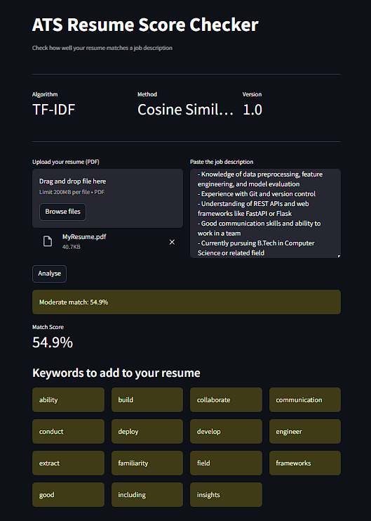

# ATS Resume Checker

A web app that scores how well your resume matches a job description using NLP.

## Live demo
[Try it here](https://huggingface.co/spaces/Vader26/ats-resume-checker)

## What it does
- Calculates a match score (0–100%) using TF-IDF and cosine similarity
- Identifies keywords from the job description missing in your resume
- Gives colour-coded feedback — strong, moderate, or low match

## Tech stack
Python · Streamlit · Scikit-learn · PyMuPDF · NLTK

## Run locally
git clone https://github.com/sankeerthts54-glitch/ats-resume-checker.git
cd ats-resume-checker
pip install -r requirements.txt
streamlit run app.py

## About
Built by Sankeerth TS — CS undergrad in Bangalore exploring AI/ML and NLP.